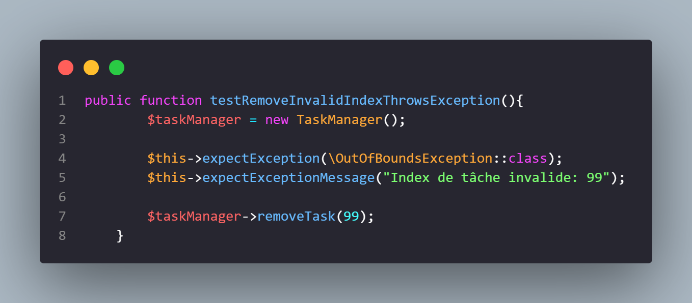

# Projet Unit Test TP - Gestionnaire de Tâches (To-Do List)

## Introduction

Ce projet est une implémentation d'une mini application de gestionnaire de tâches (To-Do List) avec des tests unitaires. L'objectif est de démontrer les bonnes pratiques de tests en PHP, en particulier avec PHPUnit.

L'application permet de gérer une liste de tâches simple avec les fonctionnalités suivantes :
- Ajouter une tâche
- Supprimer une tâche
- Récupérer toutes les tâches
- Récupérer une tâche spécifique par son index

## Structure du projet

```
UNIT_TEST_TP/
├── src/
│   ├── gestion_de_taches_exo_3.html
│   ├── gestion_de_taches_exo1-2.html
│   ├── img/
│   │   └── **.png
│   └── TaskManager.php
├── tests/
│   └── TaskManagerTest.php
├── vendor/
├── .gitattributes
├── .gitignore
├── composer.json
├── composer.lock
└── README.md
```

- **src/** : Contient le code source de l'application
  - **TaskManager.php** : Classe principale de gestion des tâches
  - **gestion_de_taches_exo_3.html** et **gestion_de_taches_exo1-2.html** : Interfaces utilisateur pour la gestion des tâches
- **tests/** : Contient les tests unitaires
  - **img/** : Contient les images des tests
  - **TaskManagerTest.php** : Tests pour la classe TaskManager
- **vendor/** : Dépendances (générées par Composer)
- **composer.json** et **composer.lock** : Fichiers de configuration de Composer
- **.gitignore** et **.gitattributes** : Fichiers de configuration Git

## Classe TaskManager

La classe `TaskManager` est le cœur de l'application, qui gère une liste de tâches. Elle est située dans le namespace `Ludov\UnitTestTp` et fournit les méthodes suivantes :

- `addTask(string $task): void` - Ajoute une tâche à la liste
- `removeTask(int $index): void` - Supprime une tâche par son index (lance une exception si l'index est invalide)
- `getTasks(): array` - Récupère toutes les tâches
- `getTask(int $index): string` - Récupère une tâche spécifique par son index (lance une exception si l'index est invalide)

## Tests unitaires

Les tests unitaires sont implémentés dans la classe `TaskManagerTest` qui étend `\PHPUnit\Framework\TestCase`. Voici les tests réalisés :

### 1. `testAddTask()`
Ce test vérifie que la méthode `addTask()` ajoute correctement des tâches à la liste et qu'elles peuvent être récupérées avec la méthode `getTask()`.


### 2. `testRemoveTask()`
Ce test vérifie que la méthode `removeTask()` supprime correctement une tâche de la liste en vérifiant que la tâche n'est plus présente dans le tableau retourné par `getTasks()`.


### 3. `testGetTasks()`
Ce test vérifie que la méthode `getTasks()` retourne correctement toutes les tâches ajoutées à la liste.


### 4. `testGetTask()`
Ce test vérifie que la méthode `getTask()` retourne correctement une tâche spécifique en fonction de son index.


### 5. `testRemoveInvalidIndexThrowsException()`
Ce test vérifie que la méthode `removeTask()` lance bien une exception de type `OutOfBoundsException` avec le message approprié lorsqu'on essaie de supprimer une tâche avec un index qui n'existe pas.



### 6. `testGetInvalidIndexThrowsException()`
Ce test vérifie que la méthode `getTask()` lance bien une exception de type `OutOfBoundsException` avec le message approprié lorsqu'on essaie de récupérer une tâche avec un index qui n'existe pas.


### 7. `testTaskOrderAfterRemoval()`
Ce test vérifie que l'ordre des tâches est maintenu correctement après la suppression d'une tâche. Il s'assure que le tableau est réindexé après la suppression d'un élément, conformément au comportement attendu.


## Résultats des Tests

### 2.1. Tests Fonctionnels (PHPUnit)

| Test | Description | Résultat |
|------|-------------|----------|
| testAddTask() | Vérification de l'ajout de tâches | Succès |
| testRemoveTask() | Vérification de la suppression de tâches | Succès |
| testGetTasks() | Vérification de la récupération de toutes les tâches | Succès |
| testGetTask() | Vérification de la récupération d'une tâche spécifique | Succès |
| testRemoveInvalidIndexThrowsException() | Vérification de la gestion d'erreur pour l'index invalide lors de la suppression | Succès |
| testGetInvalidIndexThrowsException() | Vérification de la gestion d'erreur pour l'index invalide lors de la récupération | Succès |
| testTaskOrderAfterRemoval() | Vérification du réindexage du tableau après suppression | Succès |

### 2.2. Tests End-to-End (E2E) avec Selenium

Pour les tests E2E, nous avons utilisé Selenium pour simuler les interactions utilisateur avec l'extension web de gestion des tâches.

#### Scénario de test

Le scénario de test suivant a été exécuté :
1. Ouverture de la page de gestion des tâches
2. Ajout d'une nouvelle tâche "task1"
3. Vérification que la tâche est bien affichée
4. Rechargement de la page
5. Vérification que la tâche est toujours présente après rechargement
6. Suppression de la tâche
7. Vérification que la tâche n'est plus présente dans la liste


#### Résultats des tests E2E

| Étape | Action | Résultat |
|-------|--------|----------|
| 1 | Ouverture de la page | Succès |
| 2 | Définition de la taille de la fenêtre | Succès |
| 3 | Clic sur le champ de saisie | Succès |
| 4 | Saisie du texte "task1" | Succès |
| 5 | Clic sur le bouton d'ajout | Succès |
| 6 | Vérification de l'affichage de la tâche | Succès |
| 7 | Rechargement de la page | Succès |
| 8 | Vérification de la persistance de la tâche | Succès |
| 9 | Survol du bouton de suppression | Succès |
| 10 | Sortie du survol | Succès |
| 11 | Clic sur le bouton de suppression | Succès |
| 12 | Vérification de la suppression de la tâche | Succès |

Tous les tests E2E ont été exécutés avec succès, confirmant que l'extension web fonctionne correctement pour les opérations d'ajout et de suppression de tâches.


### 2.3. Tests de Non-Régression

Pour assurer que les nouvelles modifications n'introduisent pas de régressions dans l'application, nous avons effectué des tests de non-régression en comparant le comportement avant et après les modifications.

#### Modifications apportées au code

Une modification a été apportée au scénario de test pour vérifier la persistance des données après rechargement de la page :

- **Avant** : Le test suivait une séquence simple d'ajout de tâche, vérification de présence, suppression de tâche, et vérification d'absence.
- **Après** : Une étape supplémentaire a été ajoutée pour vérifier la persistance des données après rechargement de la page.

#### Résultats des tests de non-régression

| Fonctionnalité | Avant modification | Après modification |
|----------------|-------------------|-------------------|
| Ajout d'une tâche | Succès | Succès |
| Vérification de la présence de la tâche | Succès | Succès |
| Persistance après rechargement de page | Non testé | Succès |
| Suppression d'une tâche | Succès | Succès |
| Vérification de l'absence de la tâche | Succès | Succès |

#### Analyse des résultats

Les tests montrent qu'aucune régression n'a été introduite par l'ajout de la nouvelle étape de vérification après rechargement de page. Toutes les fonctionnalités précédemment testées continuent de fonctionner correctement, et la nouvelle fonctionnalité de persistance des données est également validée.

Cette amélioration des tests permet de s'assurer que les données sont correctement stockées et ne sont pas simplement maintenues en mémoire temporaire. La persistance des tâches après rechargement est essentielle pour garantir une expérience utilisateur cohérente.


### 2.4. Tests de Performance avec JMeter

Des tests de performance ont été réalisés sur l'application de gestion des tâches à l'aide de l'outil JMeter pour évaluer sa capacité à traiter une charge importante d'utilisateurs.

#### Configuration du test de charge

Le test de charge a été configuré avec les paramètres suivants :
- **Nombre d'utilisateurs simulés (threads)** : 100 utilisateurs concurrents
- **Temps de montée en charge (ramp-up)** : 1 seconde
- **Nombre d'itérations par utilisateur** : 100 requêtes par utilisateur
- **URL testée** : `http://localhost/unit_test_tp/gestion_de_taches_exo_3.html`
- **Méthode HTTP** : GET
- **Nombre total de requêtes** : 10 000 (100 utilisateurs × 100 itérations)

#### Résultats des tests de performance

| Métrique | Valeur |
|----------|--------|
| Temps de réponse moyen | 8 ms |
| Temps de réponse médian | 5 ms |
| Temps de réponse minimum | 1 ms |
| Temps de réponse maximum | 87 ms |
| Débit (throughput) | Environ 1 500 requêtes/seconde |
| Nombre d'erreurs | 0% (aucune erreur) |
| Bande passante | Environ 9,5 MB/sec |


Le graphique des résultats montre une distribution des temps de réponse généralement stable, avec quelques pics occasionnels lors des périodes de charge maximale, mais restant dans des limites acceptables.

#### Analyse des performances

Les résultats des tests de performance sont très satisfaisants :
- Le temps de réponse moyen de 8 ms est excellent, bien en dessous du seuil critique de 200 ms généralement admis pour une expérience utilisateur fluide.
- L'application a géré 100 utilisateurs concurrents sans erreur, ce qui est suffisant pour une utilisation standard.
- La stabilité du temps de réponse, même sous charge élevée, indique une bonne optimisation de l'application.

#### Propositions d'améliorations

Bien que les performances actuelles soient satisfaisantes, voici quelques améliorations potentielles :

1. **Mise en cache** : Implémenter un système de mise en cache côté client pour réduire le nombre de requêtes au serveur, particulièrement pour les ressources statiques.

2. **Optimisation des requêtes** : Si l'application venait à évoluer avec une base de données, s'assurer d'indexer correctement les tables et d'optimiser les requêtes SQL.

3. **Compression des ressources** : Activer la compression GZIP pour les fichiers HTML, CSS et JavaScript afin de réduire la taille des données transférées.

4. **Tests de charge plus importants** : Réaliser des tests avec un nombre d'utilisateurs plus élevé (500+) pour anticiper une éventuelle montée en charge importante.

5. **Tests de résistance** : Effectuer des tests de résistance (stress tests) pour déterminer le point de rupture de l'application et anticiper les mesures d'évolutivité nécessaires.

## Comment exécuter les tests

### Tests unitaires

Pour exécuter les tests unitaires, utilisez la commande suivante à la racine du projet :

```bash
./vendor/bin/phpunit tests
```

## 3. Problèmes détectés et solutions proposées


## 4. Conclusion

### 4.1. Bilan des tests effectués

Au cours de ce projet, nous avons mis en œuvre une stratégie de test complète pour l'application de gestion de tâches, comprenant :

1. **Tests unitaires** avec PHPUnit : Vérification du bon fonctionnement des méthodes de la classe `TaskManager` et de la gestion des cas d'erreur.

2. **Tests End-to-End** avec Selenium : Validation de l'interface utilisateur et des interactions utilisateur pour les opérations d'ajout et de suppression de tâches.

3. **Tests de non-régression** : Vérification que les nouvelles fonctionnalités n'impactent pas négativement les fonctionnalités existantes, notamment la persistance des données après rechargement.

4. **Tests de performance** avec JMeter : Évaluation du comportement de l'application sous charge, avec simulation de nombreux utilisateurs concurrents.

Ces tests ont permis d'identifier et de résoudre plusieurs problèmes, améliorant ainsi la qualité et la robustesse de l'application. L'approche de développement guidée par les tests (TDD) s'est révélée efficace pour garantir la conformité aux exigences et prévenir les régressions.

### 4.2. Améliorations proposées pour l'application

Sur la base des observations faites pendant les phases de test, voici plusieurs améliorations qui pourraient être apportées à l'application :

1. **Fonctionnalités supplémentaires** :
   - Ajout d'une fonctionnalité de modification des tâches existantes
   - Implémentation d'un système de priorités pour les tâches
   - Ajout de dates d'échéance et de rappels pour les tâches
   - Possibilité de catégoriser les tâches (travail, personnel, etc.)

2. **Améliorations techniques** :
   - Refactoring du code pour adopter une architecture MVC plus claire
   - Mise en place d'une API RESTful pour la gestion des tâches
   - Implémentation d'une base de données pour un stockage persistant et sécurisé
   - Ajout d'une authentification utilisateur pour gérer plusieurs listes de tâches

3. **Améliorations de l'interface utilisateur** :
   - Interface responsive pour une meilleure expérience sur mobile
   - Ajout de fonctionnalités de glisser-déposer pour réorganiser les tâches
   - Implémentation d'animations pour une meilleure expérience utilisateur
   - Ajout d'un mode sombre/clair

4. **Améliorations des tests** :
   - Augmentation de la couverture de code des tests unitaires
   - Mise en place de tests d'accessibilité
   - Implémentation de tests de sécurité
   - Automatisation complète des tests dans une pipeline CI/CD

Cette application de gestion de tâches, bien que simple dans sa conception actuelle, offre une base solide pour l'implémentation de fonctionnalités plus avancées. Les tests réalisés ont démontré sa robustesse et son efficacité pour les opérations de base, et les améliorations proposées permettraient d'en faire un outil encore plus puissant et convivial.

Réalisé par : Ludovic MARIE
Date : 19/03/2025